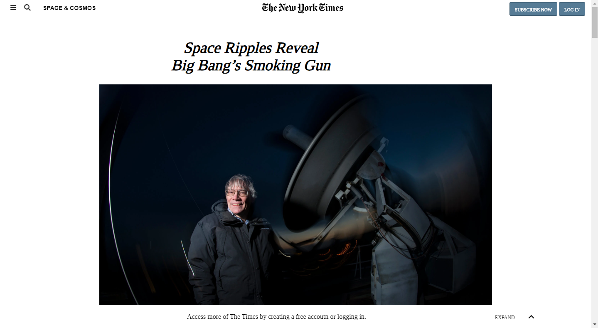

# Positioning and floating

> Youtube replica

The page tries to replicate as much as possible the actual YouTube page.

## Built With

- Html,
- CSS

## Live Demo

[Live Demo Link](https://rawcdn.githack.com/Tahirbhalli/Positioning-and-floating/8d4e036a7d9f0cbc7aa2770d3cd450201259e24e/index.html)

## Authors

👤 **Author1**

- Github: [@adamclasic](https://github.com/adamclasic)

👤 **Author2**

- Github: [@Mupa1](https://github.com/tahirbhalli/)

## 🤝 Contributing

Contributions, issues and feature requests are welcome! Start by:
* Forking the project
* Cloning the project to your local machine
* `cd` into the Youtube-Replica project directory
* Run `git checkout -b your-branch-name`
* Make your contributions
* Push your branch up to your forked repository
* Open a Pull Request with a detailed description to the development branch of the original project for a review

## 📝 License

This project is [MIT](https://opensource.org/licenses/MIT) licensed.

